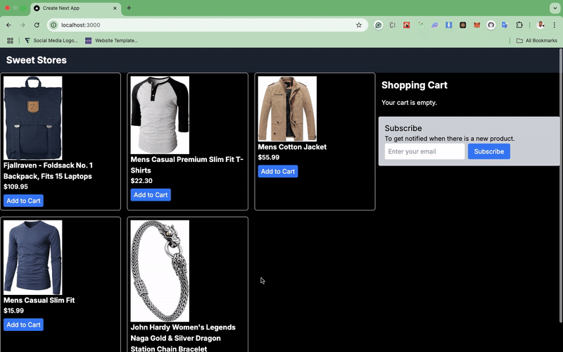

# How To Implement Push Notification In Web Application

This project demonstrates how to implement push notifications in a web application using Firebase Cloud Messaging (FCM) and Next.js. The goal is to create a real-time notification system for an e-commerce application, focusing on two key workflows:

- Sending browser push notifications to remind users about abandoned cart items.
- Delivering a warm welcome to new subscribers via push notifications and email notifications using Novu.

## Tools Used

- **Next.js**: A React framework for building server-side rendered and static web applications.
- **Firebase Cloud Messaging (FCM)**: A cross-platform messaging solution that lets you reliably send messages at no cost.
- **Novu**: A notification infrastructure for managing multi-channel notifications (email, SMS, in-app, push).

## Problem We Are Trying to Solve

Keeping users engaged and informed in real-time is critical for building a successful web application. Push notifications help drive purchases, encourage task completion, and create a more interactive user experience by:

- Reminding users about items left in their cart.
- Notifying users about urgent updates.
- Welcoming new subscribers.

## Implementation Summary

### Setting Up Firebase

1. **Register with Firebase**: Create a new project and add a web application to obtain the configuration file.
2. **Install Firebase Packages**: Use `npm install firebase firebase-admin` to install necessary packages.
3. **Initialize Firebase**: Create a `firebase.ts` file to initialize Firebase and manage push notification permissions.

### Backend Setup

1. **Express Server**: Set up an Express server in `server.js` to handle push notifications using Firebase Admin SDK.
2. **Send Notifications**: Implement endpoints to send notifications based on user actions.

### Client-Side Implementation

1. **Manage FCM Token**: Use state to manage the FCM token and request permission for notifications.
2. **Trigger Notifications**: Use `useEffect` to monitor cart items and trigger notifications if items are left in the cart.

### Integrating Novu

1. **Install Novu SDK**: Use `npm install @novu/node` to install the Novu SDK.
2. **Create Workflow**: Set up a workflow in the Novu dashboard to manage email notifications.
3. **Update Backend**: Modify the Express server to send notifications via Novu.

## Additional Resources

- [Firebase Cloud Messaging Documentation](https://firebase.google.com/docs/cloud-messaging)
- [Next.js Documentation](https://nextjs.org/docs)
- [Novu Documentation](https://docs.novu.co/)

By following this guide, you can implement a robust push notification system in your web application, enhancing user engagement and improving overall user experience.
